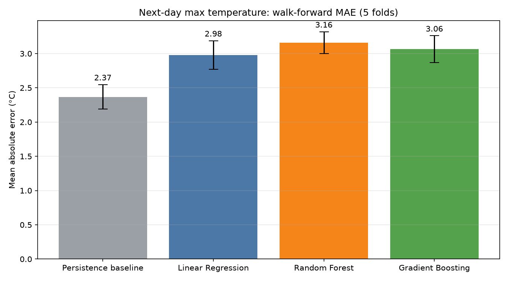
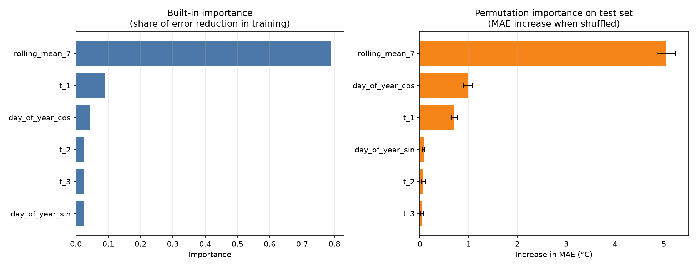
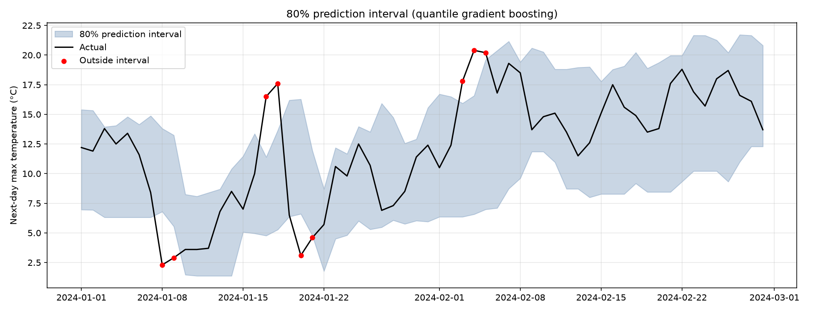

# Weather Forecast Model

Predicts tomorrow's maximum temperature from lag, rolling-window and seasonal features. Compares linear regression, random forest and gradient boosting under walk-forward validation, and adds 80% prediction intervals.

The bar to beat is the **persistence baseline** ("tomorrow = today"), which is surprisingly hard to outperform for next-day temperature.

## Results



### Feature importance



### Prediction intervals

An 80% interval from quantile gradient boosting (10th and 90th percentiles):



## Approach

1. **Data:** daily maximum temperature, minimum temperature and precipitation from the [Open-Meteo Historical Weather API](https://open-meteo.com/en/docs/historical-weather-api) (ERA5 reanalysis), 2015-01-01 to 2025-12-31 for one city.
2. **Baseline:** persistence, i.e. predict tomorrow's maximum temperature as today's.
3. **Features** (all computed only from information available at the end of today):
   - today's maximum temperature and lags `t-1`, `t-2`, `t-3`
   - 7-day rolling mean
   - day of year encoded as sine and cosine, so December and January are close together
4. **Validation:** walk-forward (expanding window) with `TimeSeriesSplit`, so every test day comes after all of its training days. A random split would leak the future into training and flatter the score.
5. **Models:** linear regression, random forest and gradient boosting, all with default settings and fixed seeds, scored on identical folds. No hyperparameter tuning.
6. **Metric:** mean absolute error (MAE) in °C, computed against the baseline on the same test days.
7. **Uncertainty:** 80% prediction intervals from quantile gradient boosting, compared with a residual-based interval fitted on held-out data.

## Getting started

```bash
git clone <your-repo-url>
cd <your-repo-folder>
pip install pandas numpy scikit-learn matplotlib requests
```

## Limitations

- **One location.** The model was built and tested on a single city. The results should not be assumed to hold in other climates.
- **Reanalysis, not station data.** ERA5 is a gridded model product, so values describe a grid cell near the coordinates, not a specific weather station.
- **Default model settings.** Models were not tuned, so the comparison shows a starting point rather than each model's best possible score.
- **Correlated features.** Lag and rolling features overlap heavily, so individual importance scores are approximate.
- **Next-day horizon only.** Longer forecast horizons were not evaluated.

## Data and credits

Weather data by [Open-Meteo.com](https://open-meteo.com/), derived from the ECMWF ERA5 reanalysis (Copernicus Climate Change Service). Open-Meteo's historical API is free for non-commercial use under CC BY 4.0, so keep this attribution.
